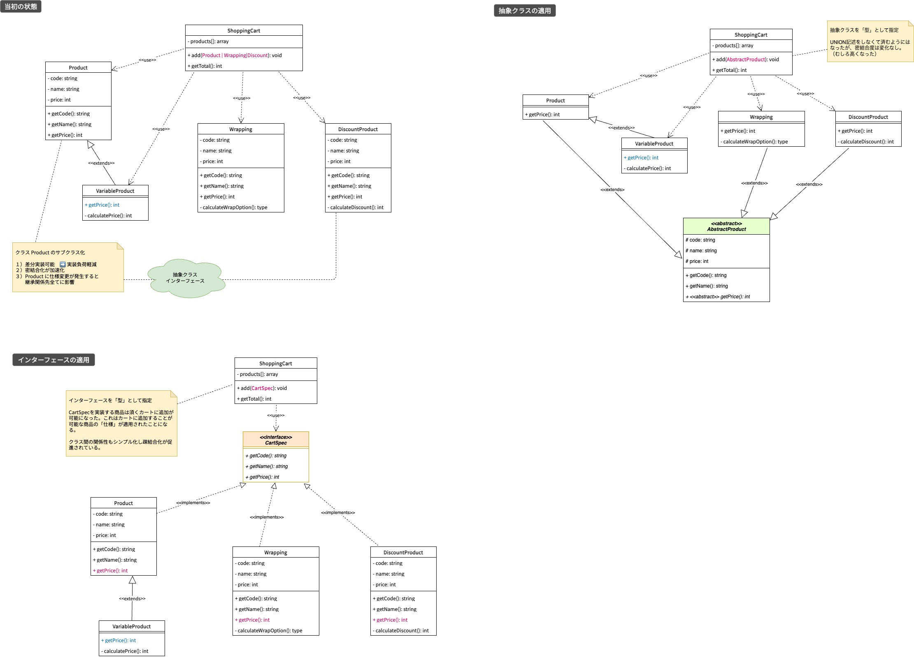
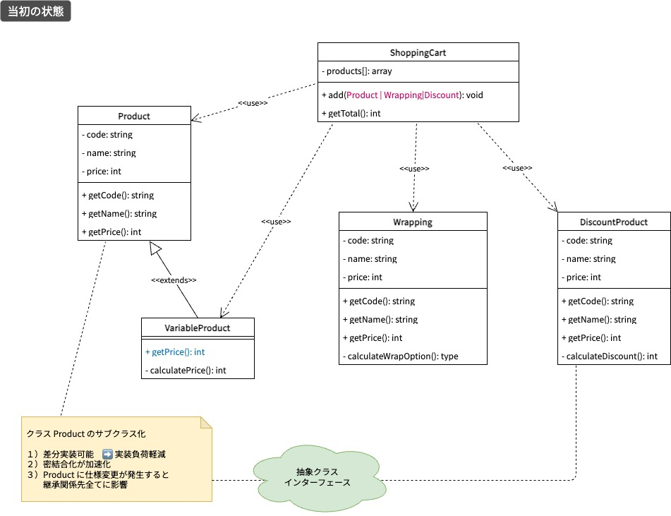
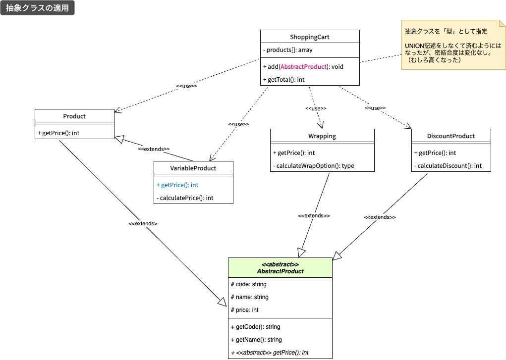
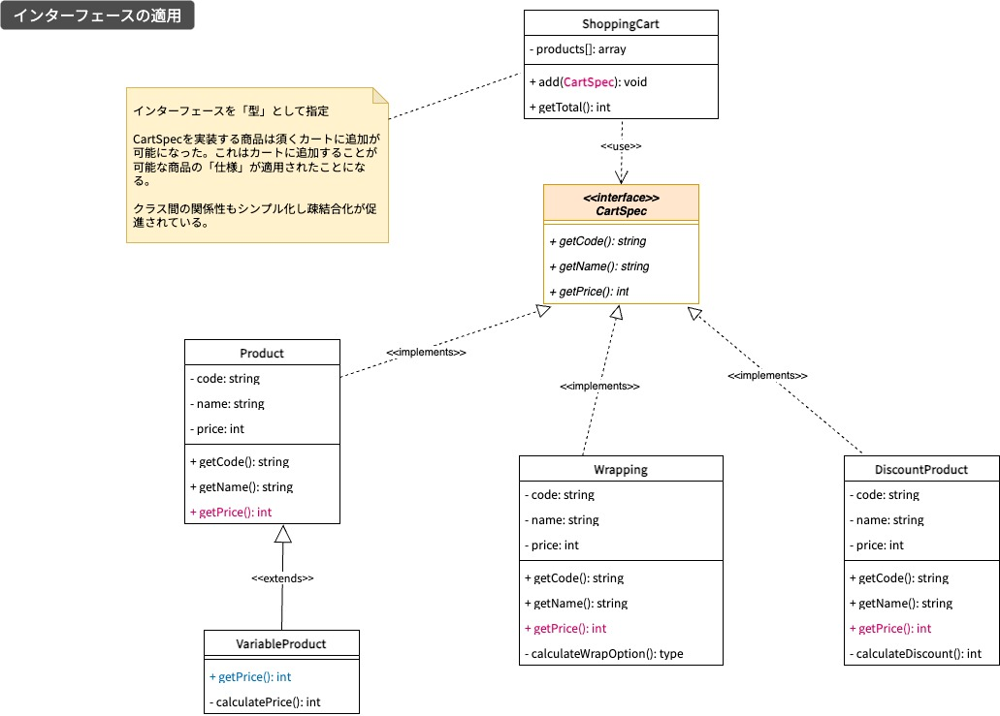

# 質問対応

**質問**
- クラス開発におけるインターフェース利用について教えてほしい
- カリキュラムでは触れていないためどんな使い方をするものか知りたい

**結論**
- クラス間の関係性を整理したり疎結合化を図る時はインターフェースを導入する
- インターフェースには必要な仕様用のメソッドシグネチャやプロパティを定義する
- 実装したインターフェースをオブジェクト通信用の「型」として使用することで特定の型を意識しなくても良くなる（抽象化）
- さらに実装コード量を削減したり、クラス仕様の汎用化をする時は抽象クラスを導入すると良い

 

## 例題

- ショッピングカートに商品を追加して合計金額とカートの中身を表示するプログラム
- 一般的な商品(`Product`)のほか次の商品を追加できるようにカートを調整する過程を`OO`概念で説明
  - 特殊な価格計算をする商品 `VariableProduct` 
  - 包装をオプションとした商品 `Wrapping`
  - 価格セールをしている商品 `Discount`

 

## 説明の流れ

1. 特にオブジェクト指向概念(`OOA`)を機にすることなく実装　➡️　step1
1. 上記「step1」を踏まえて、抽象クラスを導入した実装　➡️　step2
1. 上記「step2」を踏まえて、インターフェースを導入した実装　➡️　step3

上記の手順を踏みながら各ステップでのプログラム状況や課題などを絞りながら説明。ステップ全体のクラス図、各ステップ毎のクラス図を説明の補足として使用する。

 

### 全体

全てのステップのクラス図をまとめて以下に示す。

左から、
- 当初の状態
- 抽象クラスの適用
- インターフェースの適用

### step1

当初の状態として、初めに仕様に基づいて必要なクラスを定義した状態。

- 一般的な商品 `Product` はカートに追加することで `ShoppingCart` との関係性は「依存関係」にある
- カート側の追加メソッド `add()` では商品を扱えるように `Product` 型を定義している
- 価格計算に特殊な要件がある `VariableProduct` は `Product` を継承していることでカートにそのまま追加することができる
- 途中、包装オプションを用いる商品の取り扱いが仕様追加となり価格計算に変更が発生した
- とはいえ商品であることには変わらないため、`Wrapping` は `Product` を継承することをしない
- さらに、価格セールス品もカートに追加できるようにするための `Discount` を用意した
- これら上記の仕様変更をカートで追加できるようにするため、各クラスに対応する「型」の指定をunion記述にて対応することになった

> 👉 **課題**  
> 1. 仕様変更の度にカート側に対応が必要
> 1. 追加対象の方が増える度に変更するとメソッドシグネチャが複雑化する傾向が高い

 

### step2

step1 の課題に対応するため、**抽象クラス**の適用を実施することにした。抽象クラス `AbstractProduct` は次のメンバー定義をしたものになっている。

- protected なプロパティ：code, name, price
- public なメソッド：getCode, getName
- 抽象メソッド：getPrice

- 抽象クラスは関係するクラス間での「抽象化」を促進させる役割がある
- また、抽象クラスを継承したクラスは「同型」となる
- `protected` なプロパティとパブリックな実装メソッドにより具象クラス側の実装量を軽減することが可能
- カートのメソッド `add()` はunion記述から離脱し抽象クラスを「型」として定義することでシンプルとなった
- ただし、抽象化の促進はされてもクラス間の関係性は密結合化が促進されることとなる
- 仕様変更や特定の商品にだけ変更の適用は少々難しくなる状況に近くなった

> 👉 **課題**  
> 1. 抽象レイヤーを導入したが、クラス間の結合度が高く柔軟性が損なわれている
> 1. 仕様変更に柔軟な対応ができる状況を実現したい

 

### step3

step2 の課題に対応するため、**インターフェース**を導入することにした。`CartSpec` は次のメンバー定義をしたものになっている。

- メソッドシグネチャ：getCode
- メソッドシグネチャ：getName
- メソッドシグネチャ：getPrice

- `CartSpec` を実装することにより、カートで扱われる商品の「仕様」が適用されたことになる
- `CartSpec` の仕様に準拠しなければ、商品として扱わないという「制約」を設けることにもなる
- カートでは `CartSpec` 型の商品として扱うため統一された仕様に基づく処理に専念できる
- これによってクラス間の関係性がシンプルとなり且つ結合度も軽減される（疎結合の促進）
- 今後、仕様変更や新たな仕様が増えても新たなインターフェースやインターフェースの変更で対応が可能

 

## 参考情報
**オブジェクト指向プログラミング (OOP) 関連情報**

> 📍 **参考：**  
> https://zenn.dev/ad5/articles/7cb312fa8f3c43
> https://zenn.dev/soramarjr/articles/2160224009e15c
> https://atmarkit.itmedia.co.jp/ait/articles/1511/02/news016_2.html
> https://qiita.com/tkek321/items/a6112bc195b73438a9b0
